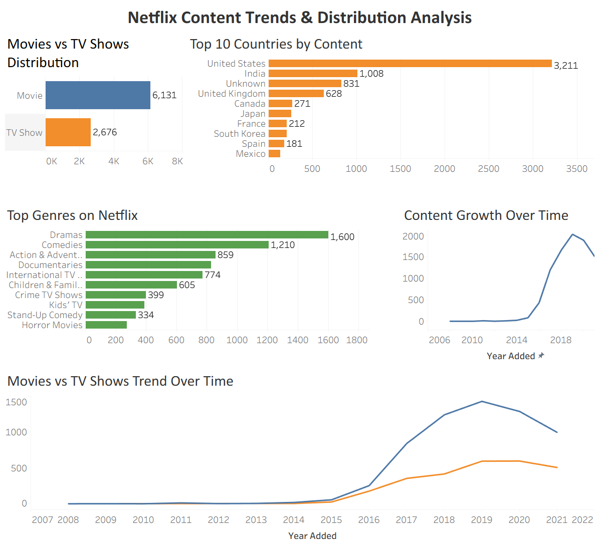

# Netflix Content Trends & Distribution Analysis

## 📊 Overview

This project analyzes Netflix content data to uncover trends in content distribution, genre popularity, and platform growth. It demonstrates an end-to-end data analysis workflow using Python, SQL, and Tableau.

---

## 🎯 Objectives

* Analyze the distribution of Movies vs TV Shows
* Identify top countries contributing content
* Explore popular genres
* Understand content growth over time

---

## 🛠️ Tools & Technologies

* Python (Pandas) – Data cleaning and preprocessing
* SQL (MySQL) – Data querying and validation
* Tableau – Data visualization and dashboard creation

---

## 📁 Project Structure

```
netflix-content-analysis/
│
├── data/
├── notebooks/
├── sql/
├── dashboard/
└── README.md
```

---

## 📊 Dashboard



---

## 📌 Key Insights

* Movies dominate Netflix’s content library compared to TV Shows
* The United States contributes the highest number of titles
* Drama and Comedy are the most common genres
* Content growth accelerated significantly after 2015

---

## 🧠 Analytical Approach

* Cleaned and transformed raw data using Python
* Created structured dataset for analysis
* Performed SQL queries to extract insights
* Built Tableau dashboard for visualization

---

## 🚀 Outcome

This project demonstrates an end-to-end data analysis workflow, combining data cleaning, SQL analysis, and visualization to generate meaningful business insights.
